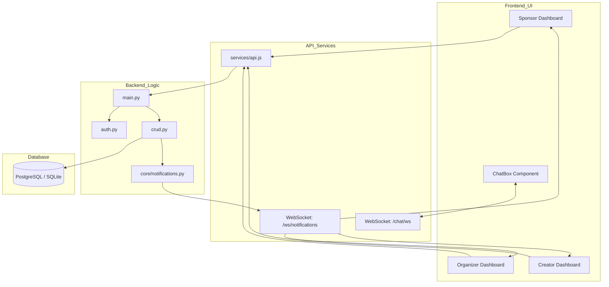

# 🏗️ Sponsorship Management System: Full Architecture & Data Flow

This document provides a 360-degree view of how the application is built, how the files interact, and how data moves through the system.

---

## 1. 📂 File Architecture (The "Where")

### **Backend (FastAPI)**
The backend follows a modular **Router-Controller-Model** pattern.

*   `backend/main.py`: **The Engine.** Initializes the app, middleware (CORS, Rate Limiting), and mounts all routers.
*   `backend/models.py`: **The Blueprint.** Defines the Database tables (Users, Events, Deals, Chat, etc.) using SQLAlchemy.
*   `backend/schemas.py`: **The Gatekeeper.** Pydantic models that validate incoming data and format outgoing JSON.
*   `backend/crud.py`: **The Worker.** Contains all Database logic (Create, Read, Update, Delete).
*   `backend/auth.py`: **The Guard.** Handles JWT generation, password hashing (Bcrypt), and session validation.
*   `backend/routers/`: **The Ports.** Modular endpoints:
    *   `auth_router.py`: Login/Register logic.
    *   `deals.py`: Complex business logic for sponsorship lifecycles.
    *   `chat.py`: **WebSocket Server** for real-time messaging.
    *   `notifications_router.py`: **WebSocket Server** for live dashboard updates.
*   `backend/core/`: **The Utilities.** Contains the Rate Limiter and Notification Manager.

### **Frontend (React + Vite)**
A modern Single Page Application (SPA) driven by a centralized API service.

*   `frontend/src/services/api.js`: **The Bridge.** Centralized Axios instance with interceptors to attach JWT tokens.
*   `frontend/src/pages/`: **The Views.**
    *   `SponsorDashboard.jsx`: Command center for brands.
    *   `OrganizerDashboard.jsx`: Management hub for event planners.
    *   `InfluencerDashboard.jsx`: Studio for creators.
*   `frontend/src/components/`: **The UI Molecules.**
    *   `ChatBox.jsx`: Real-time chat UI with WebSocket integration.
    *   `DealCard.jsx`: Intelligent component that adapts buttons based on deal status.
    *   `AgreementModal.jsx`: Digital signature interface.
*   `frontend/src/utils/mapping.js`: **The Translator.** Converts raw database objects into user-friendly UI objects.

---

## 2. 🔄 Data Flow (The "How")

### **A. Authentication Flow (Security)**
1.  **Frontend**: User enters email/pass in `Login.jsx`.
2.  **API**: Sends to `POST /auth/login`.
3.  **Backend**: `auth.py` verifies hash, generates JWT.
4.  **Security**: Token stored in `localStorage`.
5.  **Interceptors**: Every future request automatically pulls the token and adds it to the HTTP Header.

### **B. Deal Lifecycle Flow (Business Logic)**
Every deal follows a strict state machine to prevent fraud.

1.  **Discovery**: Sponsor finds an Event in the Marketplace.
2.  **Proposal**: Sponsor clicks "Work Together" → Calls `POST /deals/`.
3.  **Real-time**: Backend `notification_manager` sends a WebSocket alert to the Organizer.
4.  **Acceptance**: Both parties must click "Accept" (`PUT /deals/{id}/accept`).
5.  **Payment**: Sponsor triggers `PaymentModal` → Backend validates payment intent.
6.  **Legal**: Once `payment_done = True`, the status shifts to `signing_pending`.
7.  **Closure**: Both parties sign. Status becomes `closed`. Confetti triggers! 🎉

### **C. Real-time Communication (WebSockets)**
We move away from slow HTTP polling and use permanent sockets.

*   **Chat**: When a user types a message in `ChatBox.jsx`, it travels through a persistent WebSocket to `backend/routers/chat.py`, which saves it to the DB and instantly broadcasts it to the other participant.
*   **Notifications**: The moment an Event is created or a Deal is updated, a broadcast is sent to all relevant dashboards via `notifications_router.py` to refresh the UI immediately without a page reload.

---

## 3. 🗺️ Component Relationship Diagram

---

## 4. 🚀 Key Professional Features
1.  **Role-Based Access Control (RBAC)**: Admins, Sponsors, and Organizers see completely different sets of data based on their JWT claims.
2.  **Rate Limiting**: Protected against brute force and spam via `slowapi` on sensitive endpoints.
3.  **Optimistic UI**: Real-time updates ensure users see changes the instant they happen.
4.  **Digital Integrity**: Agreements and Payments are immutable once finalized in the state machine.
